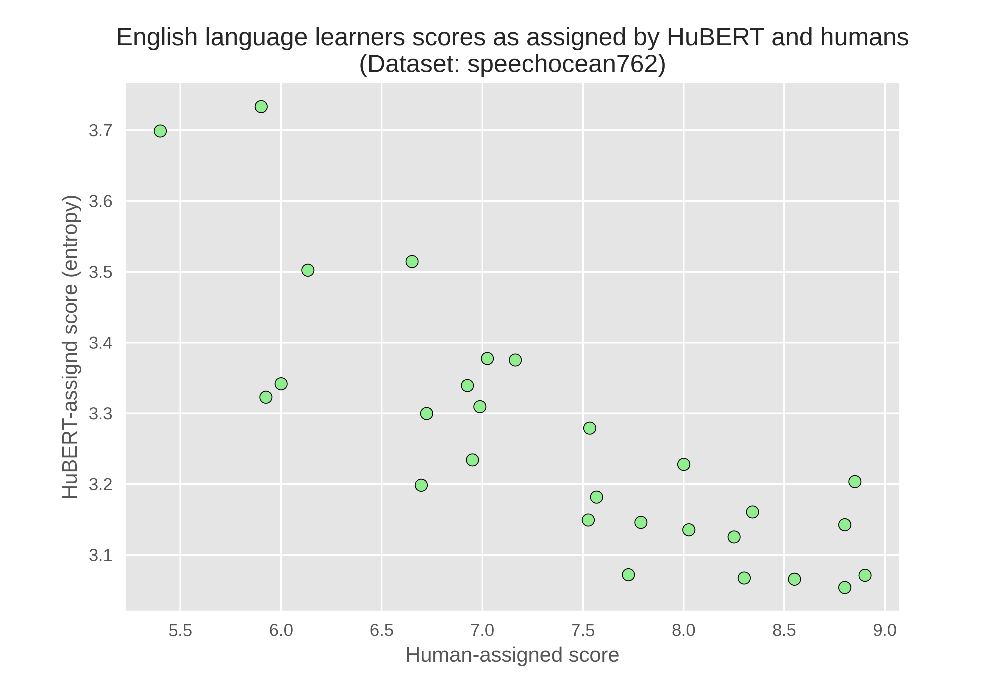

# speechscorer: a simple online spoken utterance scorer.
[](https://colab.research.google.com/github/yaya-sy/speechscorer/blob/main/demo/speechscorer.ipynb)

<p align="center">
    
</p>

This package enable you to assign a score to a given spoken utterance. This score can reflect the intelligbility or the fluency/grammaticality of the utterance.

Different models pretrained with different training objectives are proposed: HuBERT, Whisper and WavLM.

# How it works
The scoring method relies on the internal model hesitation (entropy) while predicting for the input speech. Depending on the model and its training objective, the entropy is computed differently. You can learn more about how it works by reading the documentation:
- [Models trained with the masked language model objective](docs/masked_language_modeling.md)
- [Models trained with the ASR objective](docs/conditional_language_modeling.md)

# Getting

You will first need to istall the right [PyTorch](https://pytorch.org/get-started/locally/) for your computer

Then you can install speechscorer using pip:
```bash
pip install git+https://github.com/yaya-sy/speechscorer.git
```

once installed, you can score your utterance with this command:

```bash
speechscore -a <your-audio>
```

To see more available options, run:
```bash
speechscore -h
```
# Demo

You can find a colab notebook in `demo/speechscorer.ipynb` for an example of use case.